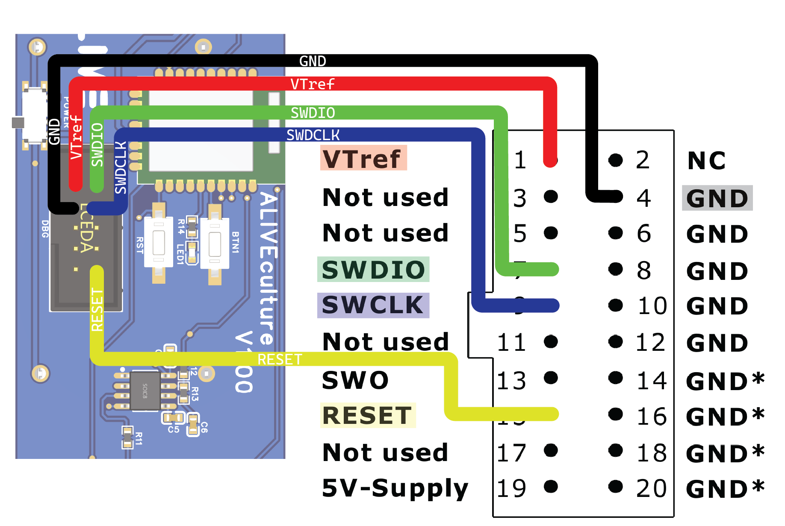
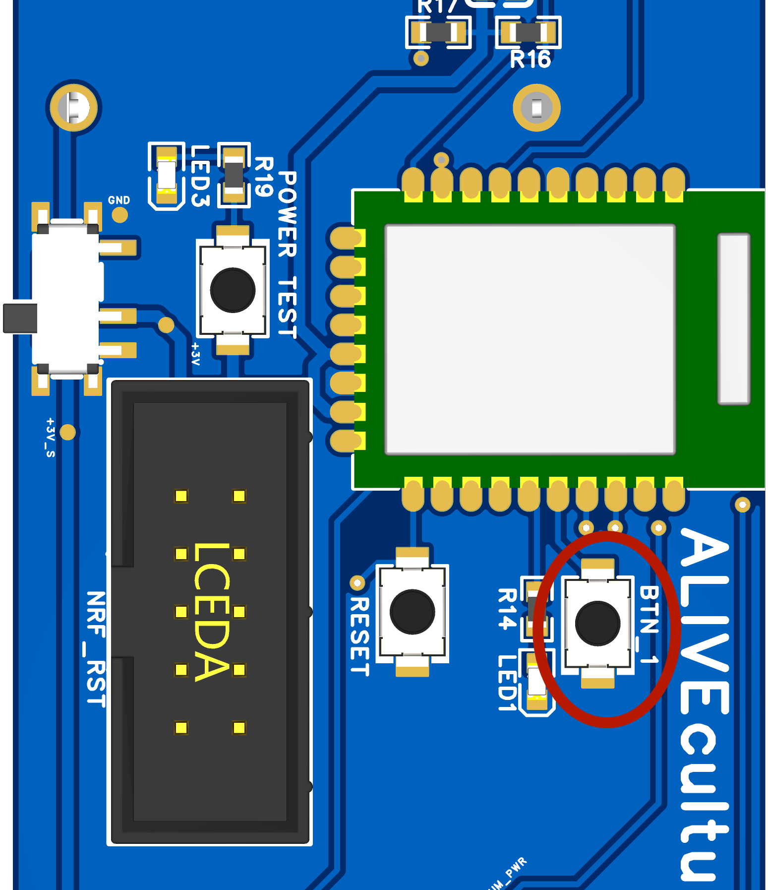
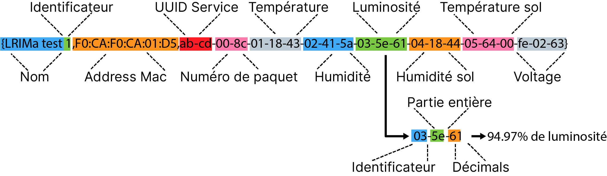

# iot_obj-sicro-sensor

## Repo composition
```bash
code/
├── actioneur    (esp32 code)
├── broadcaster  (sensor code [nrf52833])
├── central      (python serial to ALIVEcode)
└── central-nrf  (BLE reciver [nrf52840dongle])
schematics/
├── SICRO-Main-easyEDA.zip (Main Schematic)
└── SICRO-Ground-easyEDA.zip (Ground part Schematic)
```
### Physical device
The schematics and PCB were made using [EasyEDA Pro](https://pro.easyeda.com/) site
There is a protective layer that needs to be applied on the ground part of the pcb to prevent corrosion

## Building

#### Tools needed
- VS Code
- [nRF Connect](https://www.nordicsemi.com/Products/Development-tools/nrf-connect-for-desktop)
- [nRF Connect VS Code extension](https://www.nordicsemi.com/Products/Development-tools/nRF-Connect-for-VS-Code)
- nRF toolchian `v2.3.0`
- nRF SDK `v.2.3.0`
- J-Link

#### Broadcaster

##### Preparing the environment
Before building the broadcaster program, you **must** make sure that you changed the `CONFIG_BLE_USER_DEFINED_BROADCAST_MAC_ADDR` and the `CONFIG_BLE_USER_DEFINED_BROADCAST_NAME` so that they are unique. Note that the `CONFIG_BLE_USER_DEFINED_BROADCAST_NAME` must end with a number. If you need mac address, you can use this [mac address generator](https://dnschecker.org/mac-address-generator.php). You also need to update the `CONFIG_BLE_USER_DEFINED_CONN_MAC_ADDR` and `CONFIG_BLE_USER_DEFINED_CONN_NAME` if you have `CONFIG_SENSOR_SLEEP_MODIFICATION_ENABLED` set to `y`.

##### Building
To build the program for the nrf52833 you need to use the [NRFconnect](https://www.nordicsemi.com/Products/Development-tools/nRF-Connect-for-VS-Code) extension in vscode and then you just have to [follow the instructions](https://nrfconnect.github.io/vscode-nrf-connect/get_started/build_app_ncs.html#how-to-build-an-application) to build it using the `lrima_greenhouse_nrf52833` board. After you need to flash it using the [option available in the extension](https://nrfconnect.github.io/vscode-nrf-connect/get_started/quick_debug.html#how-to-flash-an-application). Note : If the board is giving out an error when flashing, use the `erase and flash` option.

###### J-Link setup


#### Firmware over the air update (DFU)
The board comes with the option to send over the air updates (ota). To prepare an update you just need to build the program like in the previous section. You need after to send the `app_update.bin` file that is located in the `build\zephyr` folder to your phone. You then need to keep press the button1 (see picture) until the led is on and then release it. You will now have 60 seconds, or more if you change the value of `CONFIG_BLE_DFU_ADV_DURATION_SEC` to start the flashing process. To do so, you will need to use the [nRF Connect mobile app](https://www.nordicsemi.com/Products/Development-tools/nrf-connect-for-mobile) and connect to the device with the name specified in `CONFIG_BLE_USER_DEFINED_CONN_NAME`. You will then need to go in the `DFU` tab and  select the `app_update.bin` file. Finally, press the `Upload` button. The flashing process will start and you will be able to see the progress in the app. When the flashing is done, the board will reboot and the new program will start.


#### Device Functionality
The device is split in two parts, the broadcaster and the connectable. The broadcaster is the part that will send the data to the central. The connectable is the part that will be used to update the firmware over the air and to change the sleep time of the device. The user can wake up the device at any time by pressing the button1. 

##### Broadcaster
The broadcaster will send the data at the interval specified in `CONFIG_SENSOR_SLEEP_DURATION_SEC` or at the interval set by the user using the connectable part. The broadcaster will send a beacon using the BLE extended advertising protocol (`BLE 5.0`) for the duration specified in `CONFIG_BLE_ADV_DURATION_SEC`. The beacon will contain the following information:


##### Connectable
The connectable part will only be active if `CONFIG_SENSOR_SLEEP_MODIFICATION_ENABLED=y` and will be visible for the same time as the broadcaster. However, if you are connected to the device, it will stay active until you disconnect or the inactivity timer is reached (`CONFIG_BLE_CONN_TIMEOUT_SEC`). The connectable part will advertise using `GATT` a service with the following UUID `0xAFBE` and with the following characteristics:
- `0xAFBF` : This characteristic will allow you to `read/write` the `sleep time` of the device. The value is a 16 bit unsigned integer that represents the number of seconds that the device will sleep. The value is stored in little endian format. The value is stored in the flash memory of the device and will be loaded at boot. The value will be reset to the default value if the device is reset.
The DFU mode won't be visible if the user hasn't pressed the button1 before the device start advertising for the duration specified in `CONFIG_BLE_DFU_ADV_DURATION_SEC`.

### Central-nrf
To build the program for the nrf52840dongle you need to use the [NRFconnect](https://www.nordicsemi.com/Products/Development-tools/nRF-Connect-for-VS-Code) extension in vscode and then you just have to follow the [instrution](https://nrfconnect.github.io/vscode-nrf-connect/get_started/build_app_ncs.html#how-to-build-an-application) to build it using the `lrima_greenhouse_nrf52833` board. After you need to flash it using the nrf programer tools available in the nrf Connect for desktop programs. You will need to put the board in [DFU mode](https://infocenter.nordicsemi.com/index.jsp?topic=%2Fug_nrf52840_dongle%2FUG%2Fnrf52840_Dongle%2Fprogramming.html). The file need for the flashing will be under the following path `build\zephyr\zephyr.hex`.

### Running

To run the sensor you will need first to plug the Central-nrf in a computer or raspberry pi and then you will need to setup the config.ini file from the `central` folder. In the config.ini you will have to specify the `object id` and the `auth token` that can be found in your IoT project on [ALIVEcode.ca](ALIVEcode.ca)

Afterward you have to install the dependency using the `pip install -r requirements.txt` command. (Using a venv is suggested.)
When it's done, you can run the project using the command. `python main.py`
When the python program is running, you can now power on the broadcaster.
