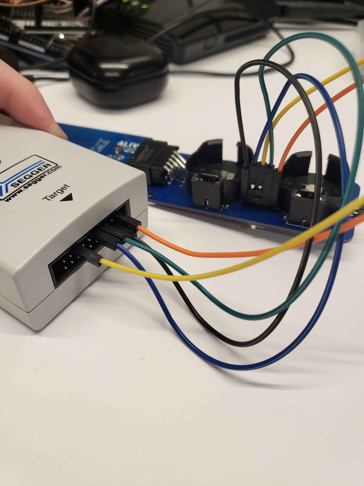
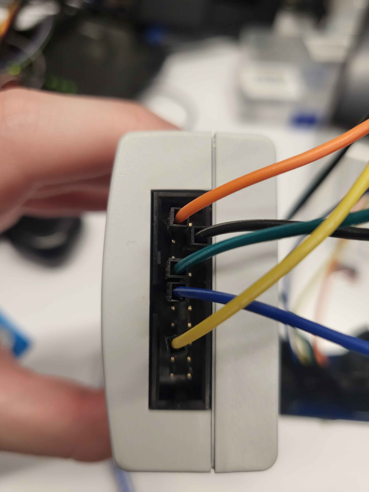
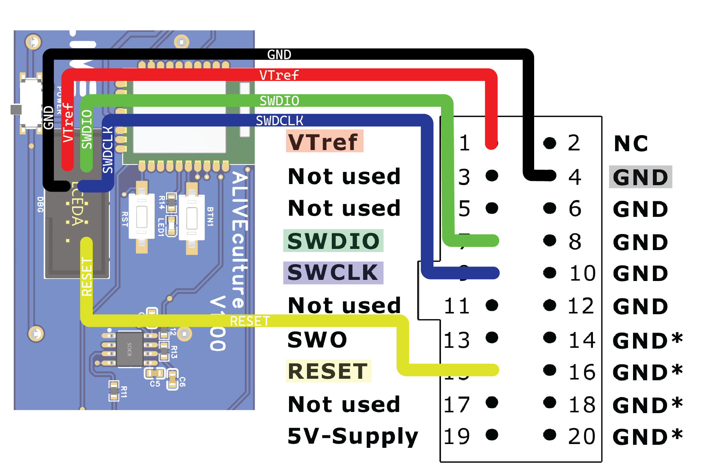
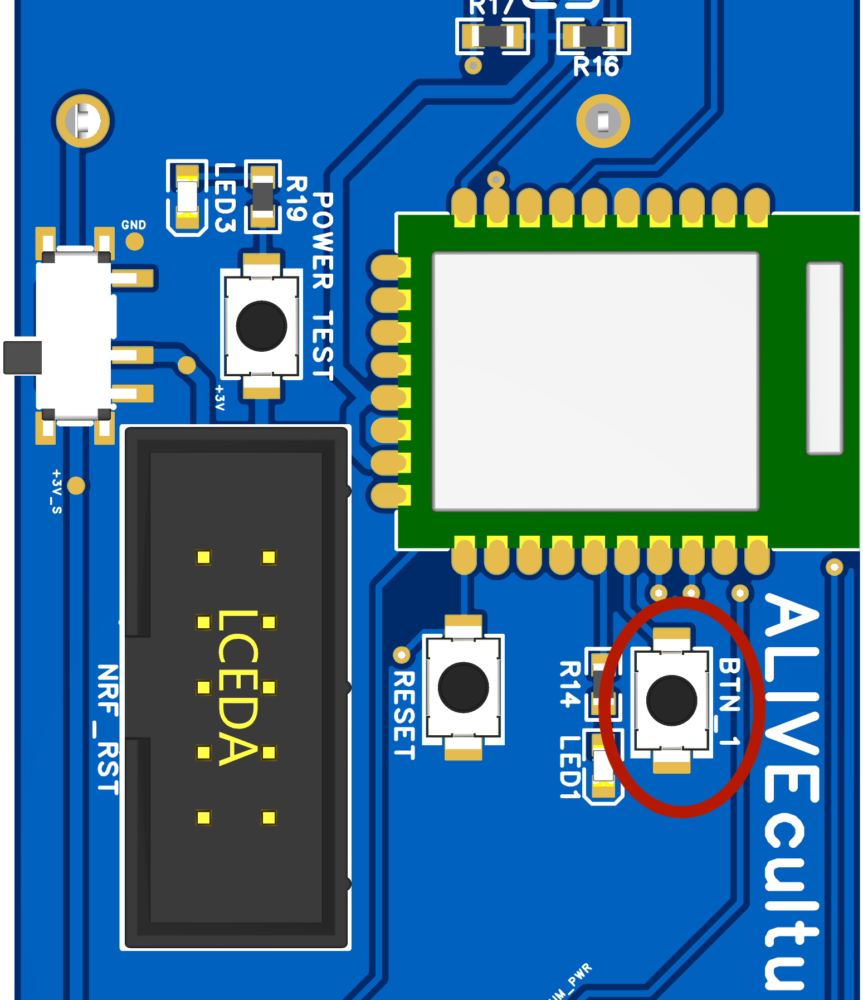
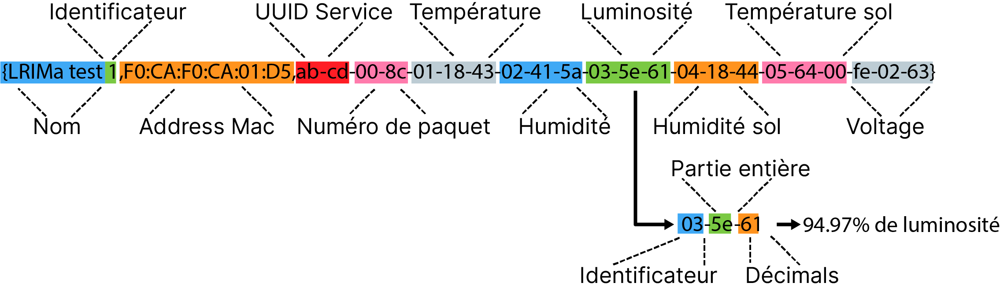

# iot_obj-sicro-sensor

Authors : LRIMa (Laboratoire de Recherche Informatique de Maisonneuve)

## Repo composition

```bash
code/
├── actioneur       (esp32 code)
├── broadcaster     (sensor code [nrf52833])
├── central         (python BLE scanning and ALIVEcode integration)
└── central-nrf     (BLE receiver [nrf52840dongle])
schematic/
├── lrima-main/     (Main board KiCad project)
└── lrima-ground/   (Ground board KiCad project)
models/
└── sensor-casing/  (3D CAD models for enclosure)
```

### Physical device

The schematics and PCB were designed using [KiCad](https://www.kicad.org/) EDA software
There is a protective layer that needs to be applied on the ground part of the pcb to prevent corrosion

## Building

#### Tools needed

- VS Code
- [nRF Connect](https://www.nordicsemi.com/Products/Development-tools/nrf-connect-for-desktop)
- [nRF Connect VS Code extension](https://www.nordicsemi.com/Products/Development-tools/nRF-Connect-for-VS-Code)
- nRF toolchain `v3.2.4`
- nRF SDK `v3.2.4`
- J-Link
- Python 3.8+ (for central application)

#### Broadcaster

##### Preparing the environment

Before building the broadcaster program, you **must** make sure that you changed the `CONFIG_BLE_USER_DEFINED_MAC_ADDR` and the `CONFIG_BLE_USER_DEFINED_NAME` so that they are unique. Note that the `CONFIG_BLE_USER_DEFINED_NAME` must end with a number (ex : 01). If you need mac address, you can use this [mac address generator](https://dnschecker.org/mac-address-generator.php).

##### Building

The broadcaster uses the **sysbuild** system from NCS v3.2.4. To build the program for the nrf52833 using the [nRF Connect VS Code extension](https://www.nordicsemi.com/Products/Development-tools/nRF-Connect-for-VS-Code):

1. Open the broadcaster folder in VS Code
2. Use the nRF Connect extension to build using the `lrima_greenhouse_nrf52833` board
3. Flash using the [extension flashing options](https://nrfconnect.github.io/vscode-nrf-connect/get_started/quick_debug.html#how-to-flash-an-application)

Note: If flashing fails, use the `erase and flash` option to perform a full erase first.

###### J-Link setup





#### Firmware over the air update (DFU)

The board supports over-the-air firmware updates. To prepare an update:

1. Build the application as described above
2. Locate the `app_update.bin` file in the `build/zephyr` folder
3. Transfer this file to your phone
4. Press and hold button1 until the LED is on, then release
5. You will have up to 60 seconds (configurable via `CONFIG_BLE_DFU_ADV_DURATION_SEC`) to start the update
6. Use the [nRF Connect mobile app](https://www.nordicsemi.com/Products/Development-tools/nrf-connect-for-mobile) to connect to the device (named with your `CONFIG_BLE_USER_DEFINED_NAME`)
7. Go to the `DFU` tab and select the `app_update.bin` file
8. Press `Upload` and monitor the progress



#### Device Functionality

The device is split in two parts, the broadcaster and the connectable. The broadcaster is the part that will send the data to the central. The connectable is the part that will be used to update the firmware over the air and to change the sleep time of the device. The user can wake up the device at any time by pressing the button1.

##### Broadcaster

The broadcaster collects sensor data and transmits it via BLE 5.0 extended advertising:

**Supported sensors:**

- Temperature/Humidity (SHT4X)
- Soil temperature/moisture/conductivity (STCC4)
- CO2 concentration

**Transmission behavior:**

- Sends data at intervals specified by `CONFIG_SENSOR_SLEEP_DURATION_SEC`
- Intervals can be modified via the connectable service
- Uses BLE extended advertising for the duration specified in `CONFIG_BLE_ADV_DURATION_SEC`
- Beacon payload structure is shown below:



> **Note:** The diagram above does not include the CO2 sensor data. CO2 concentration is transmitted as an additional sensor value in the beacon payload. (value needs to be multiplied by 10 to get the actual concentration in ppm)

##### Connectable

The connectable part will only be active if `CONFIG_SENSOR_SLEEP_MODIFICATION_ENABLED=y` and will be visible for the same time as the broadcaster. However, if you are connected to the device, it will stay active until you disconnect or the inactivity timer is reached (`CONFIG_BLE_CONN_TIMEOUT_SEC`). The connectable part will advertise using `GATT` a service with the following UUID `0xAFBE` and with the following characteristics:

- `0xAFBF` : This characteristic will allow you to `read/write` the `sleep time` of the device. The value is a 16 bit unsigned integer that represents the number of seconds that the device will sleep. The value is stored in little endian format. The value is stored in the flash memory of the device and will be loaded at boot. The value will be reset to the default value if the device is reset.
  The DFU mode won't be visible if the user hasn't pressed the button1 before the device start advertising for the duration specified in `CONFIG_BLE_DFU_ADV_DURATION_SEC`.

### Central-nrf

The central-nrf firmware runs on the nRF52840 dongle to receive BLE broadcasts from the broadcaster.

**Building:**

1. Use the [nRF Connect VS Code extension](https://www.nordicsemi.com/Products/Development-tools/nRF-Connect-for-VS-Code) to build for `nrf52840dongle_nrf52840` board
2. Flash using the nRF Connect for Desktop programmer tools
3. Put the device in [DFU mode](https://infocenter.nordicsemi.com/index.jsp?topic=%2Fug_nrf52840_dongle%2FUG%2Fnrf52840_Dongle%2Fprogramming.html)
4. Flash the `build/zephyr/zephyr.hex` file

### Central (Python Application)

The central application handles BLE scanning, data collection, and integration with ALIVEcode.

**Core modules:**

- `core/storage.py` - Persistent data management
- `core/payload.py` - Sensor data parsing and validation
- `core/aliot_sync.py` - ALIVEcode cloud integration
- `core/health.py` - System health monitoring
- `core/config.py` - Configuration management

**Setup and running:**

1. Plug the Central-nrf dongle into a computer or Raspberry Pi
2. Configure the application:
   - Copy `config.ini.example` to `config.ini`
   - Set your `object_id` and `auth_token` from your [ALIVEcode.ca](https://ALIVEcode.ca) IoT project

3. Install dependencies:

   ```bash
   # For Raspberry Pi 4
   pip install -r requirements_pi4.txt

   # For Raspberry Pi 5
   pip install -r requirements_pi5.txt
   ```

   (Using a Python virtual environment is recommended)

4. Run the application:

   ```bash
   python main.py
   ```

5. Power on the broadcaster devices

The application will automatically scan for and connect to broadcaster devices, collecting sensor data and synchronizing with ALIVEcode.
