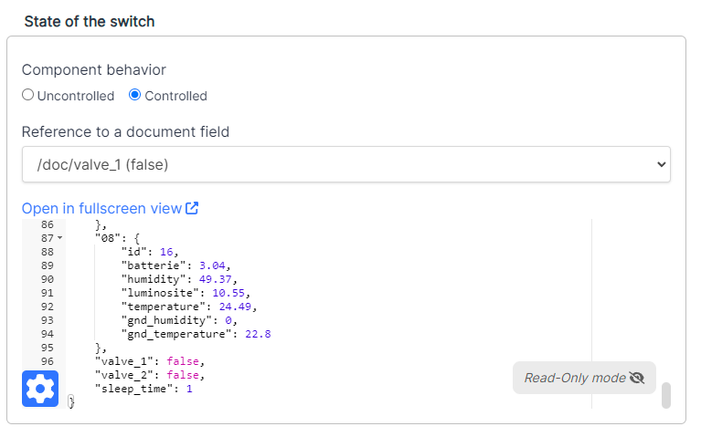
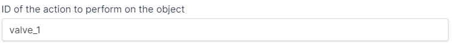

# Actionneur

## Description
This folder contains the code for the esp32 that controls relays from ALIVEcode.

## How to use

### Seting up the secrets
You must setup the `SECRET.h` file witht the `SSID` and `PASSWORD` of the wifi network you want to connect to.
Also you need to set the `AUTH_TOKEN` and `OBJECT_ID` from the device page on ALIVEcode.
The `SECRET.h` file should look like this:
```c++
/**
 * Fill in the credentials below
 * For the Wifi and the Aliot credentials
*/

// Setup wifi credentials
#define SSID "SSID"
#define PASSWORD "PASSWORD"

// Setup aliot credentials
#define AUTH_TOKEN "AUTH_TOKEN"
#define OBJECT_ID "OBJECT_ID"
```

### Setting up the relays
You need to setup the relays in the `main.cpp` file.

#### Defining the relays
The relays are defined in the `valves` array. like this:
```c++
const Valve valves[] = // Changed to an array
    {
        {
            .actionId = "valve_1",
            .pin = 2,
            .isPinInverted = true
        },
        {
            .actionId = "valve_2",
            .pin = 4,
            .isPinInverted = true
        }
    };
```
_Note : You can not have more relay than the value of `MAX_ACTION_COUNT` in `Aliot-C` (the default value is 5)_
- The `actionId` field is the id of the action *and* the field value on ALIVEcode.
- The `pin` field is the pin number on the esp32.
- The `isPinInverted` field is used to invert the pin state. (If the relay is active when the pin is low, set this to `true`)

#### Adding the callbacks
For each relay you need to add the following bit of code:
`main.cpp` callback function:
```c++
// Function to be called when valve 1 state is changed on ALIVEcode
bool callbackValve1(const char* data) {
    
    Serial.print("New valve 1 state:");
    Serial.println(data);

    // Set valve 1 state
    setValveState(valves[0], stringToBool(data));

    return true;
}

void setup() {
    // ...

    // Add the callback to the valve 1
    addCallback(valves[0].actionId, callbackValve1);

    // ...
}
```

### Adding controls on AliveCode

1. Create a toggle component
2. Set the toggle to be controlled by the document with `actionID`

3. Set the Id of the action to the `actionID`

4. Repeat 1-3 for each relay in the list


### Installing the libraries
The project uses platformio to manage the libraries. You can install it from [here](https://platformio.org/install/ide?install=vscode).
After installing platformio, you need to install the libraries. You can do this by opening the project in vscode and clicking on the `PlatformIO: Build` button in the bottom left corner. (The library installation should start automatically)

#### Libraries used
- [ArduinoJson](https://arduinojson.org/)
- [Aliot-C](https://github.com/ALIVEcode/aliot-c)
- [WiFiClientSecure](https://www.arduino.cc/en/Reference/WiFiClientSecure)
- [ArduinoHttpClient](https://www.arduino.cc/reference/arduinohttpclient/)

### Uploading the code
You can upload the code to the esp32 by clicking on the `PlatformIO: Upload` button ( :arrow_right: ) in the bottom left corner of vscode. (You need to have the esp32 connected to your computer)

#### Relay board specific
1. You need to set the board in `Boot` mode to upload the code. 
    > (You can do this by shorting the `BOOT` header before connecting the esp32 to power)
2. After the board is powered, you can unshort the `BOOT` header.
3. You need to make sure that all the `DIP` switches are set to the relay side.
    > (If you don't do it, the board won't flash properly. This is due to the fact that `PIN 12` must be set to `low`)

### Monitoring the serial output
You can monitor the serial output by clicking on the `PlatformIO: Serial Monitor` button ( :electric_plug: ) in the bottom left corner of vscode. (You need to have the esp32 connected to your computer)


